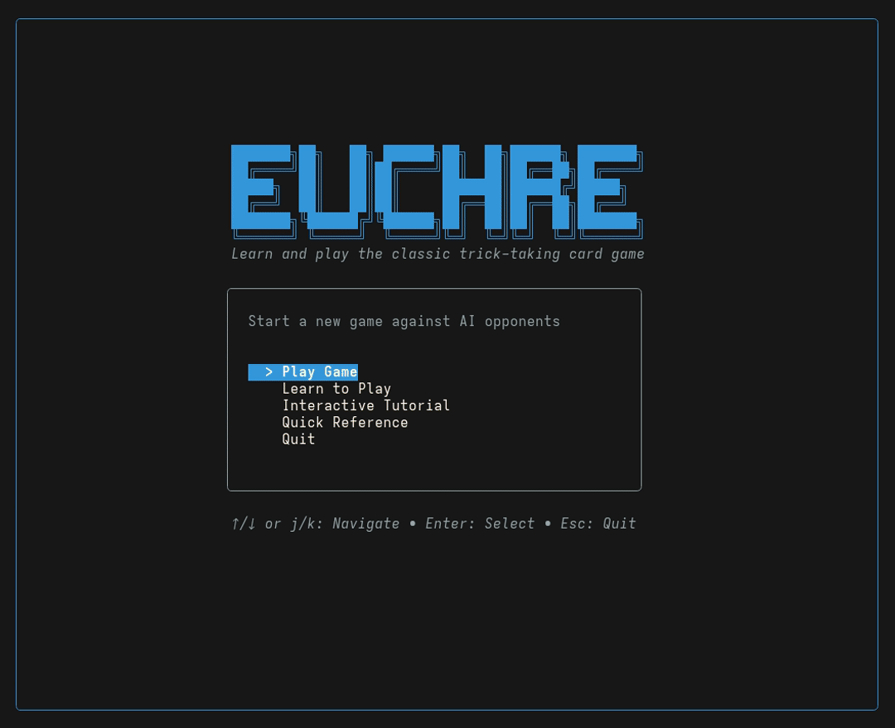
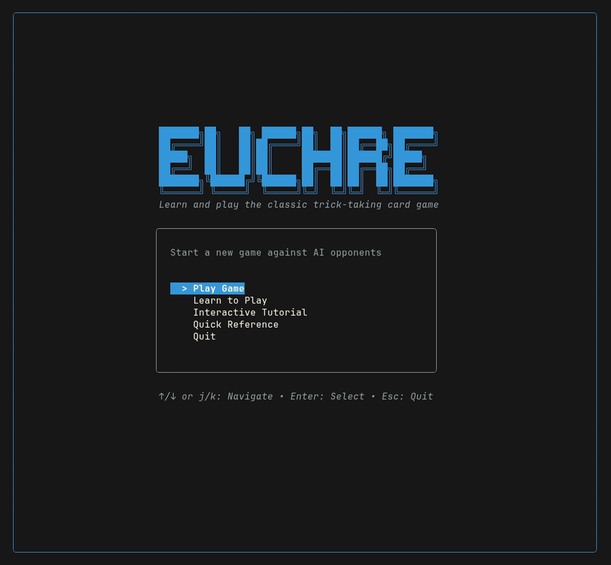

# Euchre


A terminal-based Euchre card game with AI opponents and a built-in coach, built with [Bubble Tea](https://github.com/charmbracelet/bubbletea).



## Install

Pick whichever is easiest — the game is a single self-contained binary with no runtime dependencies.

**One-line install (macOS / Linux, no Go needed)**
```bash
curl -fsSL https://raw.githubusercontent.com/BrandonDedolph/euchre/main/install.sh | sh
```
Downloads the right prebuilt binary for your OS/arch and drops it in your PATH. Set `EUCHRE_INSTALL_DIR` to choose where it lands.

**Download a prebuilt binary manually**
Grab the archive for your OS/arch from the [latest release](https://github.com/BrandonDedolph/euchre/releases/latest), extract it, and run `euchre`.

**With Go installed (1.24+)**
```bash
go install github.com/BrandonDedolph/euchre/cmd/euchre@latest
euchre
```

**From source**
```bash
git clone https://github.com/BrandonDedolph/euchre.git
cd euchre
make run        # or: go run ./cmd/euchre
```

> Runs in any modern terminal; use at least an ~80×24 window (it falls back to a compact layout on narrow terminals).

## Features

- **Full game vs AI** — authentic Euchre dealt in 2s-and-3s packets, bidding, going alone, and trick play against rule-based opponents
- **Interactive Tutorial** — play a real, randomly-dealt hand with a coach that narrates every moment, spotlights the recommended card, grades your move, and pops up teachable moments
- **Polished TUI** — colored HUD with team scoreboards, a contract banner, a play-by-play ticker, card animations, and a responsive layout (with a compact mode for narrow terminals)
- **Learn to Play** — guided lessons on the rules and strategy
- **Quick Reference** — in-game rules with visual card examples
- **Variants** — stick-the-dealer and defend-alone, toggleable in setup

## Interactive Tutorial

Pick **Interactive Tutorial** from the menu to play a genuine hand with a coach looking over your shoulder. The coach box narrates the deal and every player's turn, the coach's recommended card is highlighted in gold with a `▼` arrow, and key concepts (like the left bower) surface as dismissible popups the first time they come up.



## Controls

| Key | Action |
|-----|--------|
| `↑↓` or `jk` | Navigate menus |
| `←→` or `hl` | Select card / suit |
| `Enter` | Confirm / order up / play / continue |
| `p` | Pass (bidding) |
| `a` | Order up / call alone |
| `y` / `n` | Defend alone (when offered) |
| `?` | Toggle the controls overlay (in game) |
| `Esc` | Back / Quit |

## Euchre Basics

4 players, 2 teams, 24 cards (9-A). First to 10 points wins.

**Trump Hierarchy:** Right Bower (J of trump) > Left Bower (J of same color) > A > K > Q > 10 > 9

**Scoring:** 3-4 tricks = 1pt | March (5 tricks) = 2pts | Alone march = 4pts | Euchred = 2pts to defenders

## Development

```bash
make build      # Build to bin/euchre
make test       # Run tests
make lint       # Run linter
```

<details>
<summary>Project Structure</summary>

```
cmd/euchre/          # Entry point
internal/
  ai/rule_based/     # AI strategy (also drives the tutorial coach)
  app/               # TUI screens, coach, and teachable popups
  engine/            # Game logic
  tutorial/          # Guided lesson system
  ui/components/     # Card and table rendering
  variants/          # Rule variants
```
</details>

## Acknowledgments

Built with the [Charm](https://charm.sh) ecosystem: [Bubble Tea](https://github.com/charmbracelet/bubbletea), [Lip Gloss](https://github.com/charmbracelet/lipgloss). Demo GIFs recorded with [VHS](https://github.com/charmbracelet/vhs).

## License

MIT
